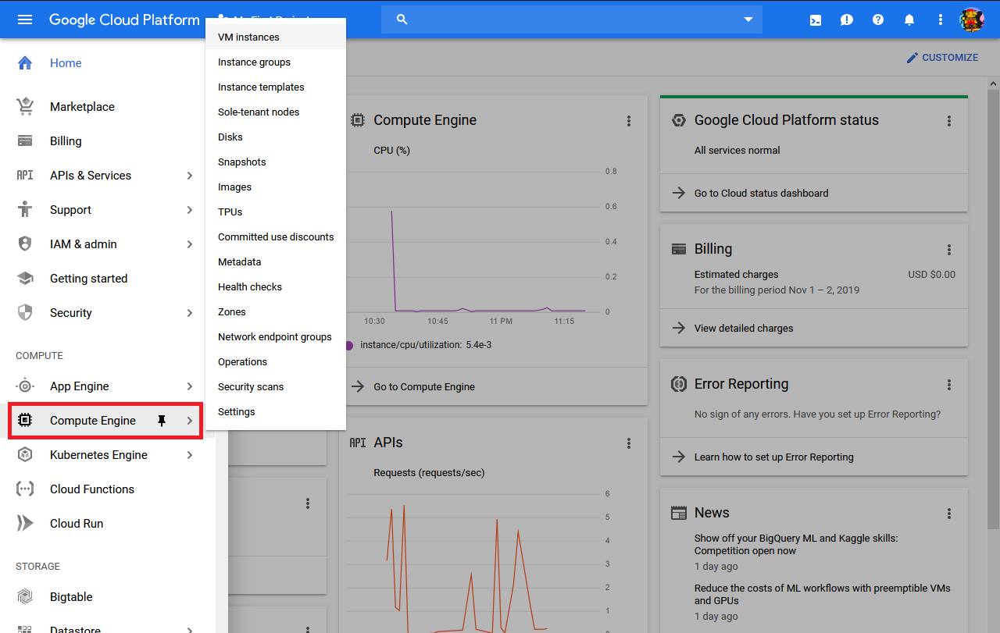
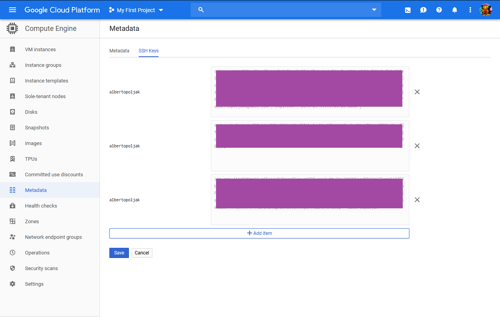

# Creating a Compute Engine instance

Google Compute Engine instance is just a fancy word for VPS.

Go to https://cloud.google.com/ and click "Go to Console"

Register if you didn't already - you will need gmail and a valid credit card information (look below in #Important section 
for more info on when you will get charged.)

You will be redirected to https://console.cloud.google.com/

Click navigation menu -> Compute Engine

Click `CREATE INSTANCE`

You will be moved to this screen:

Here you can select all the options for your compute instance.

Currently (November 2019) when you register you will get 300$ of credit that last for 1 year + always free tier.

**You will always have free tier available! It is a separate offer! Not to be confused with 300$ offer!**

# Important (ye this is very important, people are confused about this all the time):

> When you register, your account is on a trial period (1 year) and cannot be charged. You need to update to PAID
account in order for your credit card to be charged. Currently only thing that's going to be charged are your free credits.
If your credits reach 0$ your service is stopped because Google can't charge you until you upgrade to paid account.

> Credits last more that 1 year, it's just that after 1 year you can't use them anymore until you upgrade to PAID account, remaining credits don't disappear
and you can still use what's remained of them after you upgrade to PAID account.

> ***1 year 300$*** offer and ***Always free tier*** are 2 **separate** offers.
You can use always free tier , as it sais, always! Even after 1 year! You can use always free tier alongside
free trial offer without deducting your trial credits (as long as your always free tier products don't exceed their limits as 
described in https://cloud.google.com/free/docs/gcp-free-tier). If they do exceed them then the charge is deducted from your
credits.

## Setting up always free tier

In this tutorial we'll cover how to set up a free VPS like service using Google Compute Engine.

So far we've gotten to the part where we're  creating a compute instance, these are the options for always free tier:

Currently, if you look at [this google link](https://cloud.google.com/free/docs/gcp-free-tier) under "Always Free usage limits"
subsection "Compute Engine" it's stated that only these regions are available for your always free tier:
    
    Oregon: us-west1
    Iowa: us-central1
    South Carolina: us-east1

That's why I selected `us-central1` even tho I'm from Europe.

Under machine type I've selected `f1-micro` which is the only one available for the always free tier.

It has 1 vCPU core (you get 20% of available computing power of that core with few seconds of "bursts" meaning 
it can go over 20% for a few seconds) and it has 614MB of RAM.

You can select any OS, I've selected newest Debian.

HDD cannot exceed 30gb as stated in always free usage limits - I've selected 10GB as it's enough for me.

If you've selected everything in accordance with always free usage limits you will get a message on the right, under
your credit balance, saying `Your first 722 hours of f1-micro instance usage are free this month.`

As you see in my image above it sais that its estimated cost is 4.28$ monthly or 0.006$ hourly, but we're getting it for free for
first 722h of the month (that covers entire month). If we exceed 722h usage per month we will be deducted 0.006$ hourly
(we can exceed 722h only if we're using 2 or more f1-micro instances at the same time).

You can leave all the other options to their default values - you can always change them later if you need them.
Click "Create" button at the bottom:

We have created our own, completely free, compute instance:

Note the "External IP" - it is used for connecting to your VPS (SSH, SFTP etc..).

# Connecting to Google compute instance using SSH 

We're gonna use program [Bitvise](https://www.bitvise.com/ssh-client-download) as it's much powerful
than rudimental Putty.

In order to connect to our instance we're gonna need to create a SSH key.

Start up Bitvise and click "New profile":

Under "Server" section "Host" we put our "External IP" which we can find in our instances window and "Port" is 22 aka the 
default port for SSH connections:

Now we can create SSH key right from Bitvise, click "Client key manager":

Click "Generate new"

You don't have to put comment nor do you have to put password (only if you wish), click "Generate":

You can see it's been generated under "Profile 1":

We need to export it so click "Export"

Select "Export public key" and "OpenSHH format" then click "Export" and save it somewhere where you can easily find it:

Open the saved file using notepad:

Copy the entire text:

Now go to your compute instances window and click "Metadata":

Click "SSH keys" and then "Edit" that's right under it:

Click "Add item"

Paste the key we copied from notepad into opened field:

It will warn you that the format is not correct. All you need to do is add either your username or email at the end
(username is the part before @ in email):

Click "Save", now go to Bitvise and under "Authentication" change:

> The username you just entered in your SSH key (or email)

> Initial method: Public key

> Client key: Profile 1 (the one we created previously and copy pasted to Google SHH keys)

After you click "Log in" it's done, now you can use terminal console, SFTP etc

